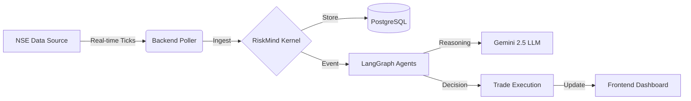

# 🧠 RiskMind: AI-Driven Algorithmic Trading Assistant

> **A Next-Gen Trading Platform that uses Autonomous AI Agents (LangGraph) and Google Gemini 2.5 Flash to analyze market risk, execute trades, and explain decisions in plain English.**

    

---

## 🚀 Key Features

*   **🤖 Multi-Agent Workflow**: A sophisticated 5-agent pipeline (Market, Risk, Decision, Validation, Audit) orchestrated by **LangGraph**.
*   **🧠 LLM Reasoning**: Uses **Google Gemini 2.5 Flash** to analyze complex market signals and provide human-readable rationales for every trade.
*   **⚖️ Human-in-the-Loop**: High-risk trades (Urgency > 7) are flagged for manual review, ensuring AI doesn't go rogue.
*   **📊 Real-Time Risk Engine**: continuously calculates Value at Risk (VaR), Volatility, and Exposure using live NSE data.
*   **🛡️ Circuit Breakers**: Automatic trading halts if loss thresholds or error rates are exceeded.
*   **🔐 Production Ready**: Secure authentication (Clerk), robust database (PostgreSQL), and scalable infrastructure (Docker/Redis).

---

## 🏛️ System Architecture

RiskMind moves beyond simple scripts by using a stateful, graph-based architecture.

### 1. High-Level Flow


### 2. The Agentic Pipeline (LangGraph)
Every stock tick triggers this autonomous workflow:

1.  **📥 Market Agent**: Validates data, normalizes symbols (e.g., `TCS` -> `TCS.NS`), and checks for data anomalies.
2.  **📊 Risk Agent**: Calculates **Risk Score (0-1)** based on technicals (RSI, MACD) and quantitative metrics (VaR, Volatility).
3.  **⚖️ Decision Agent**:
    *   **Rule Engine**: Applies hard constraints (Stop Loss @ -5%, Take Profit @ +10%).
    *   **LLM Strategy**: Asks **Gemini** for strategy if the rule engine is indecisive or high urgency.
4.  **🕵️‍♂️ Validation Agent**: A "Devil's Advocate" agent that critiques the proposed trade. If it finds flaws, the trade is rejected.
5.  **📝 Audit Agent**: Logs the entire thought process and execution details to the database for compliance.

---

## 🛠️ Tech Stack

| Component | Technology |
| :--- | :--- |
| **Frontend** | React 18, Vite, TailwindCSS, Zustand, Recharts |
| **Backend** | Node.js (v20), Express, TypeScript |
| **AI / LLM** | **LangGraph**, **Google Gemini 2.5 Flash** |
| **Database** | PostgreSQL (managed by Prisma ORM) |
| **Queue/Cache** | BullMQ, Redis (for async processing) |
| **DevOps** | Docker, Nginx, DigitalOcean, Vercel |

---

## 🚦 Getting Started

### Prerequisites
*   Docker & Docker Compose
*   Node.js v20+ (for local dev)
*   Google Gemini API Key (Get it from [Google AI Studio](https://aistudio.google.com/))

### 🐳 Run with Docker (Recommended)

1.  **Clone the repository**:
    ```bash
    git clone https://github.com/your-username/init-to-win-it-stocks.git
    cd init-to-win-it-stocks
    ```

2.  **Configure Environment**:
    Create a `.env` file in `backend/` and `frontend/` based on the `.example` files.
    **Crucial**: Add your `GEMINI_API_KEY` in `backend/.env`.

    > **⚠️ Note on Gemini API**: We use the free tier of Gemini 2.5 Flash. It has rate limits. If you see "429 Too Many Requests" errors, wait a minute for the quota to reset.

3.  **Start Services**:
    ```bash
    sudo docker-compose up --build
    ```

4.  **Access the App**:
    *   **Frontend**: `http://localhost:5173`
    *   **Backend**: `http://localhost:5000`

---

## 🔐 Login Credentials

The system comes pre-seeded with a demo user account. You can use these credentials to log in and test the specific "User Profile" features.

| Role | Email | Password |
| :--- | :--- | :--- |
| **Test User** | `tejasdivekar9057@gmail.com` | *(Handled by Clerk Auth / Any valid OTP)* |

*Note: Since we use Clerk for authentication, you can also simply "Sign Up" with any valid email to create a new account.*

---

## 🧪 Testing the System

1.  **Dashboard**: You will see a "Tick Simulator" on the dashboard (in Dev mode).
2.  **Simulate Data**: Click buttons to send simulated price updates for `RELIANCE` or `TCS`.
3.  **Watch Agents**: Observe the "Action Feed" panel. You will see the AI agents picking up the new price, calculating risk, and publishing decisions in real-time.
4.  **Chat with AI**: Go to the "Chat" page and ask: *"How is my Reliance position doing?"* or *"Why did you sell TCS?"*. Use the Gemini-powered agent to get context-aware answers.

---

## 📂 Project Structure

```
riskmind/
├── backend/                # Node.js API & Agent Logic
│   ├── src/
│   │   ├── agents/         # LangGraph Agent Definitions
│   │   ├── services/       # Gemini, NSE, Database Services
│   │   └── workers/        # Background Job Processors
│   ├── prisma/             # Database Schema & Seed
│   └── Dockerfile
├── frontend/               # React Dashboard
│   ├── src/
│   │   ├── components/     # UI Components
│   │   ├── services/       # API Clients
│   │   └── pages/          # Application Routes
│   └── Dockerfile
└── nginx/                  # Reverse Proxy Config
```

---

## 🤝 Contributing

Contributions are welcome! Please fork the repo and submit a PR.
built with ❤️ by **Tejas Dherange**
